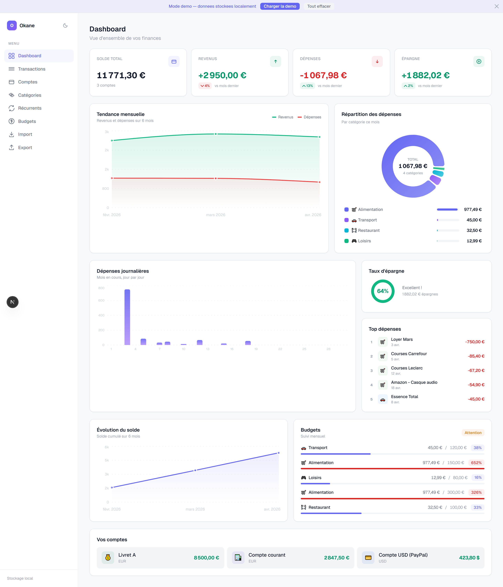
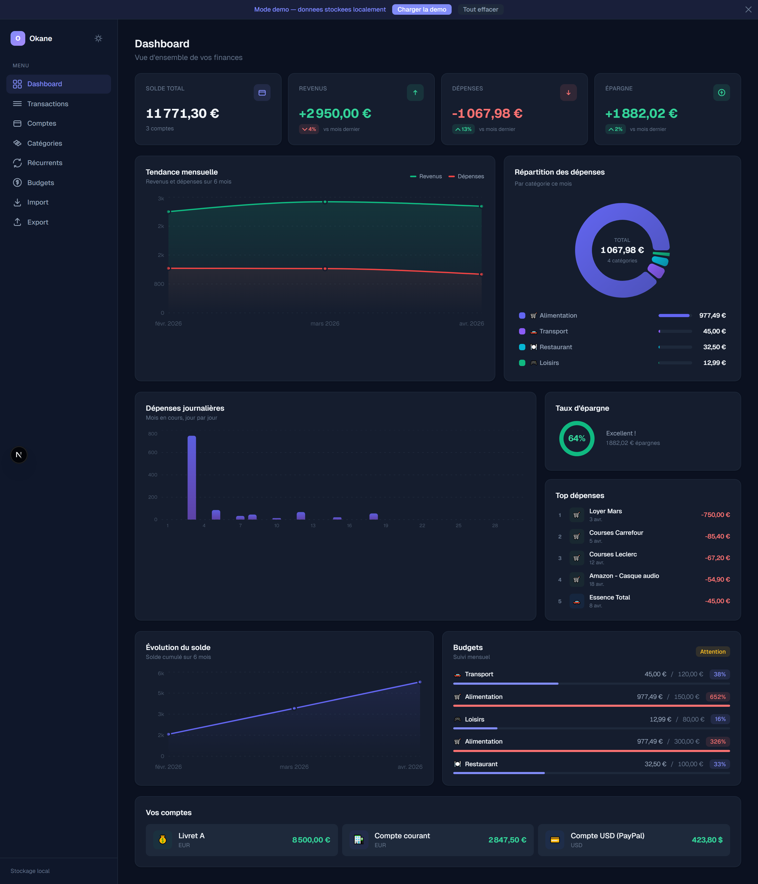
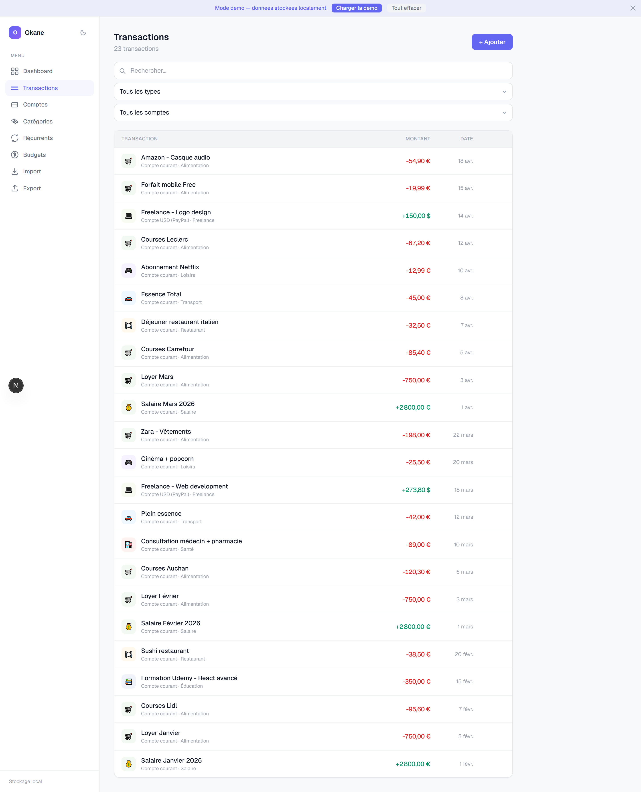
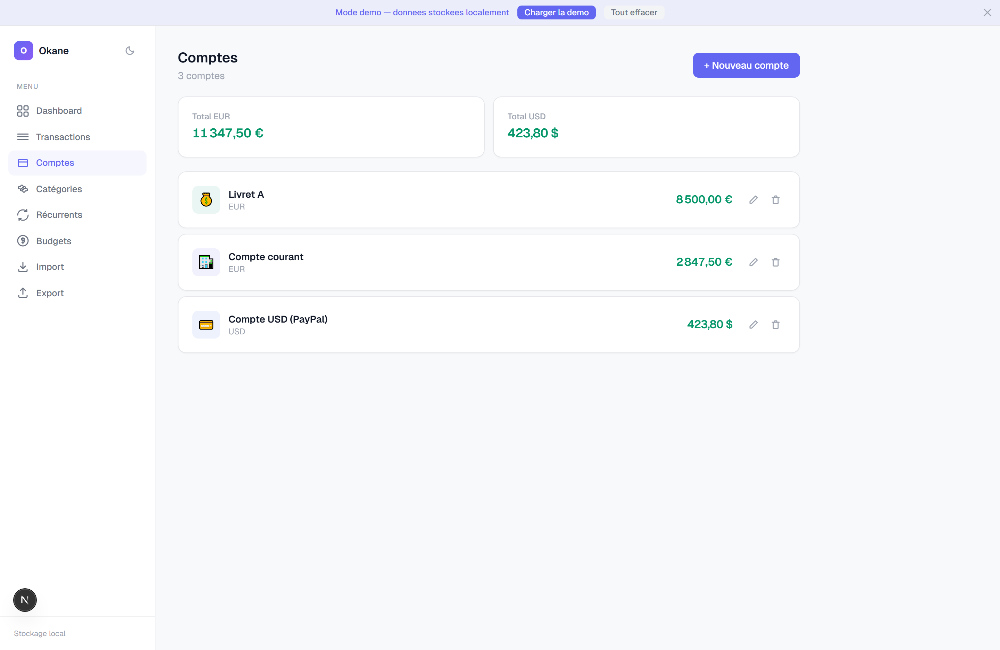
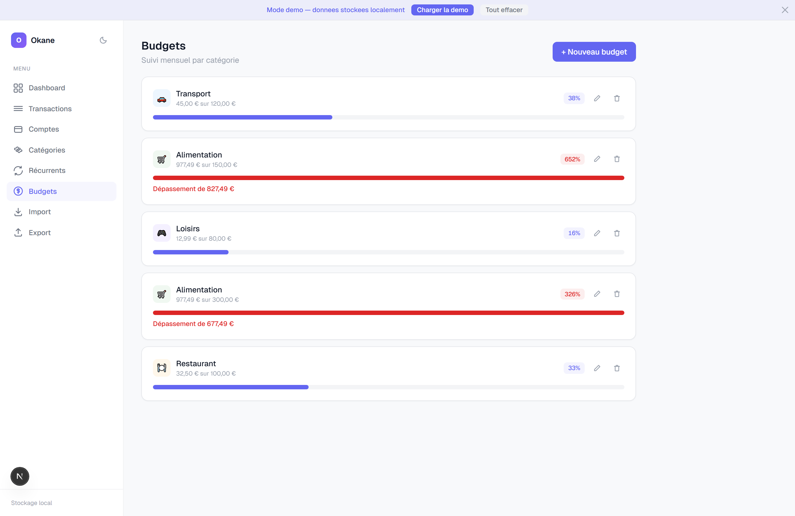
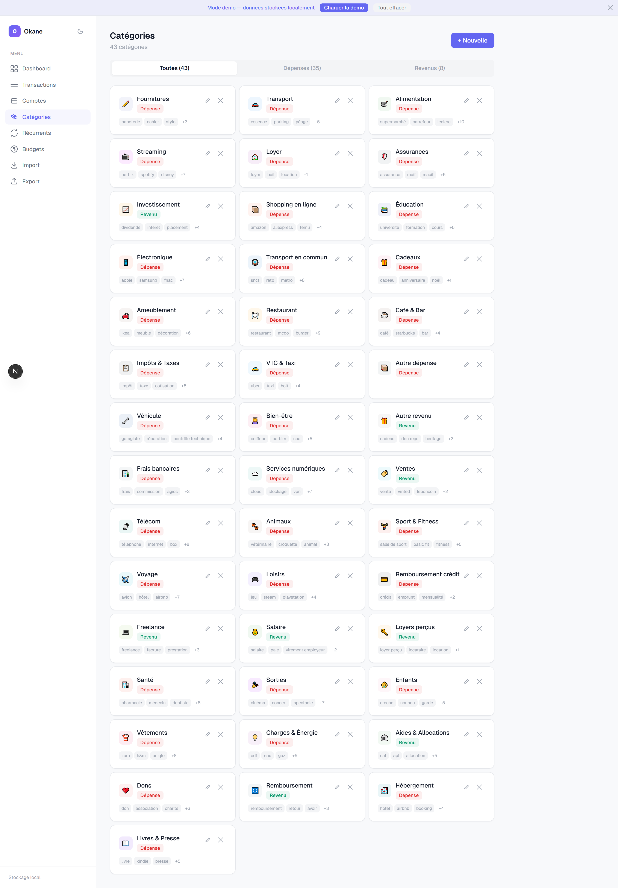
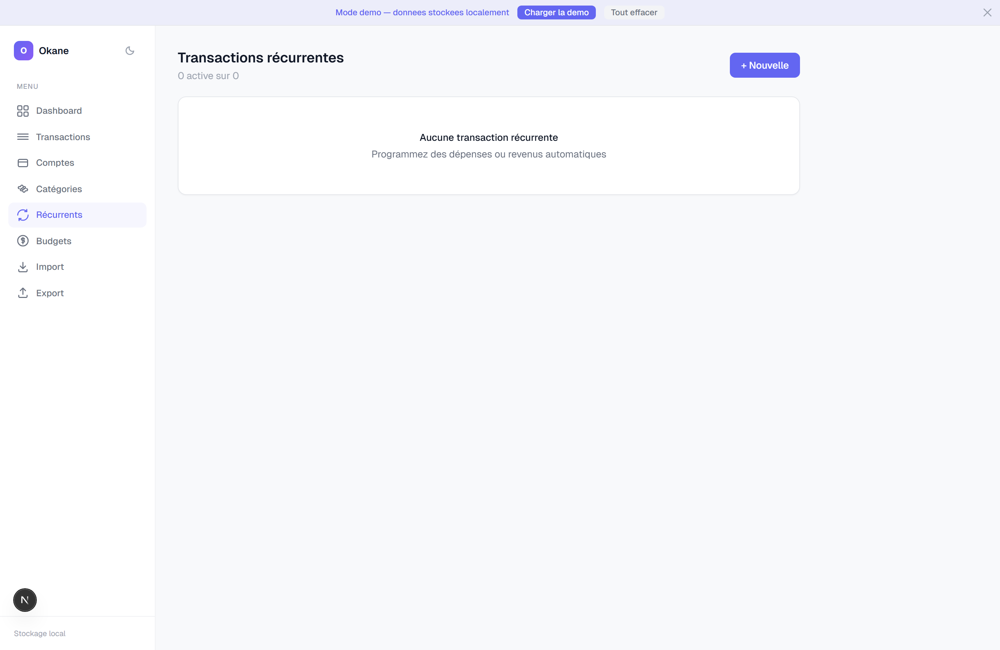
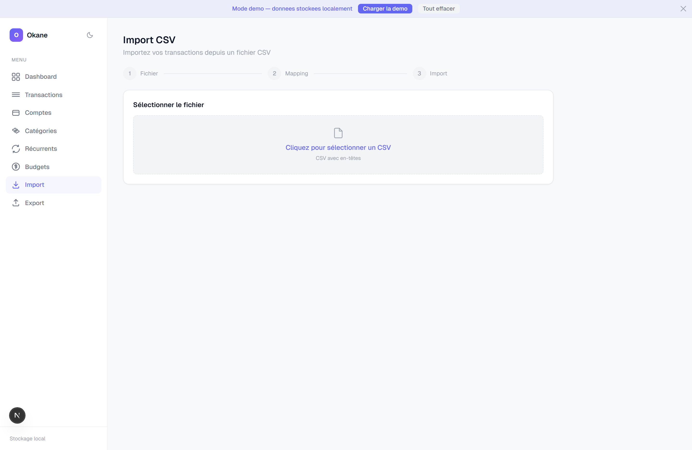

<div align="center">

# Okane お金

**Gestionnaire de finances personnelles — open source, local-first, sans serveur.**

Vos données restent dans votre navigateur. Aucun compte, aucune inscription, aucun tracking.

[](https://imenemedjaoui.github.io/okane-personal-finance/)

[Fonctionnalités](#fonctionnalités) · [Captures d'écran](#captures-décran) · [Installation](#installation) · [Stack technique](#stack-technique) · [Architecture](#architecture-des-données) · [Licence](#licence)

</div>

---

## Fonctionnalités

- **Multi-comptes & multi-devises** — EUR, USD, GBP, MAD, JPY, CHF, CAD, TND et plus
- **Transactions complètes** — Dépenses, revenus et transferts entre comptes avec modification et suppression
- **Import CSV** — Importez vos relevés bancaires avec mapping de colonnes intelligent et auto-détection des champs
- **Export CSV / JSON** — Exportez toutes vos données en un clic
- **Catégorisation automatique** — Les transactions importées sont catégorisées par mots-clés configurables
- **40+ catégories prédéfinies** — Alimentation, Transport, Logement, Santé, Loisirs, etc.
- **Transactions récurrentes** — Programmez des dépenses et revenus automatiques (quotidien, hebdomadaire, mensuel, trimestriel, semestriel, annuel)
- **Liste de souhaits** — Ajoutez des objets ou services à acheter avec prix, catégorie et priorité, puis confirmez l'achat sur un de vos comptes
- **Budgets mensuels** — Définissez des plafonds par catégorie avec barres de progression et alertes de dépassement
- **Dashboard riche** — 6 visualisations interactives : tendance mensuelle, répartition par catégorie (donut), dépenses journalières, taux d'épargne, évolution du solde, suivi des budgets
- **Thème clair / sombre** — Bascule instantanée avec transitions fluides
- **Responsive** — Interface adaptée desktop et mobile avec navigation bottom bar
- **Mode démo** — Données d'exemple pour tester l'application en un clic
- **100% local** — Stockage IndexedDB, aucune donnée ne quitte votre navigateur

## Captures d'écran

### Dashboard

<div align="center">



</div>

### Dashboard — thème sombre

<div align="center">



</div>

### Transactions

<div align="center">



</div>

### Comptes

<div align="center">



</div>

### Budgets

<div align="center">



</div>

### Catégories

<div align="center">



</div>

### Transactions récurrentes

<div align="center">



</div>

### Import CSV

<div align="center">



</div>

## Installation

```bash
git clone https://github.com/imenmusic/okane.git
cd okane
npm install
npm run dev
```

Ouvrir [http://localhost:3000](http://localhost:3000).

> Cliquez sur **"Charger la démo"** dans la bannière en haut pour explorer avec des données d'exemple.

## Stack technique

| Technologie | Rôle |
|---|---|
| [Next.js 16](https://nextjs.org/) | Framework React (App Router, Turbopack) |
| [React 19](https://react.dev/) | UI |
| [Tailwind CSS v4](https://tailwindcss.com/) | Styles utilitaires |
| [Dexie.js](https://dexie.org/) | Wrapper IndexedDB (stockage local) |
| [Recharts](https://recharts.org/) | Graphiques (Area, Bar, Pie, RadialBar) |
| [PapaParse](https://www.papaparse.com/) | Parsing CSV |
| TypeScript | Typage statique |

## Architecture des données

Aucun serveur requis. Toutes les données sont stockées localement dans IndexedDB via Dexie.js :

```
accounts             Comptes bancaires (nom, devise, solde, icône, couleur)
transactions         Dépenses, revenus, transferts (montant, date, catégorie, notes)
categories           Catégories avec icônes, couleurs et mots-clés d'auto-catégorisation
budgets              Budgets mensuels par catégorie
recurringTransactions  Transactions programmées (fréquence, dates, statut actif/pause)
wishlistItems        Liste de souhaits (nom, prix, catégorie, priorité, statut d'achat)
settings             Préférences utilisateur (devise, thème, locale)
```

## Déploiement

L'application est statique et peut être déployée sur n'importe quel hébergeur :

**Vercel** (recommandé) :
1. Pusher le repo sur GitHub
2. Connecter à [vercel.com](https://vercel.com)
3. Déployer en un clic

**Autres options** : Netlify, Cloudflare Pages, GitHub Pages (avec export statique).

## Auteure

**Imène MEDJAOUI**

## Licence

MIT
